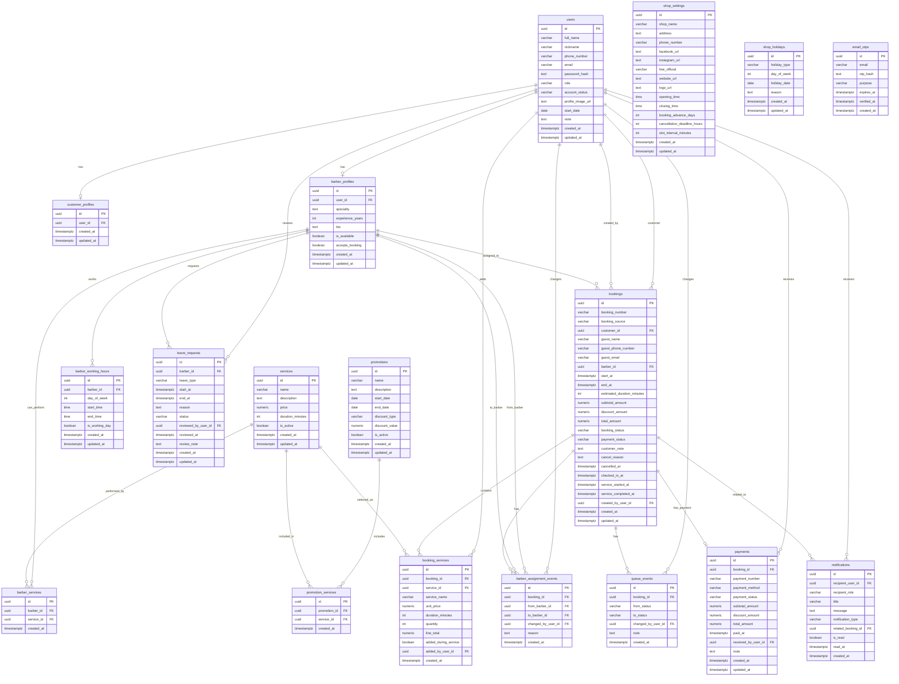

# Database ERD

## Version

Version: 1.0  
Status: Draft  
Source: 03_DATABASE_DESIGN.md

## Overview

This document shows the Entity Relationship Diagram for Rodeo Barber Shop Management System.

The ERD is written with Mermaid so it can be viewed directly in Markdown-supported tools.

## Mermaid ERD

## Relationship Notes

- A user can be a customer, barber, front desk staff, owner, or admin.
- A user can have one customer profile.
- A user can have one barber profile.
- A booking can belong to a registered customer or store guest information directly.
- A booking can have no barber at first when the customer chooses shop assignment.
- A booking contains one or more booking service rows.
- Booking service rows store service name, price, and duration snapshots.
- A booking should have only one active paid payment record.
- Queue changes and barber assignment changes are stored as event history.
- Promotions can apply to multiple services.
- Notifications can target a specific user or a role.

## ERD Review Checklist

- [ ] Confirm whether one user can have both customer and barber roles.
- [ ] Confirm whether walk-in customers need reusable customer profiles.
- [ ] Confirm whether bank transfer or QR Payment needs slip image upload.
- [ ] Confirm whether promotions apply during booking or only during payment.
- [ ] Confirm whether report export needs stored report history.
