# System Flow

## Version

Version: 1.0  
Status: Draft  
Source: Approved project scope document

## Overview

This document describes the main system flows for Rodeo Barber Shop Management System.

The flows are written with Mermaid so they can be previewed in Markdown-supported tools.

## Main System Flow

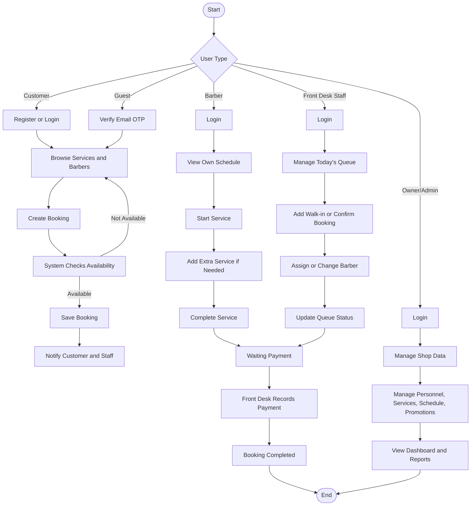

## Customer Booking Flow

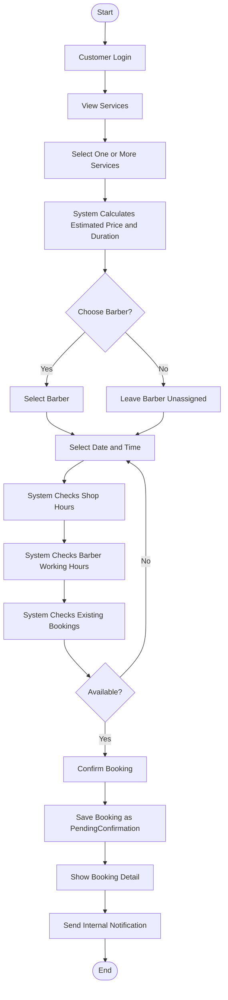

## Guest Booking Flow

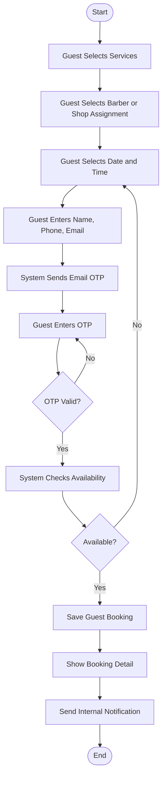

## Customer Cancellation Flow

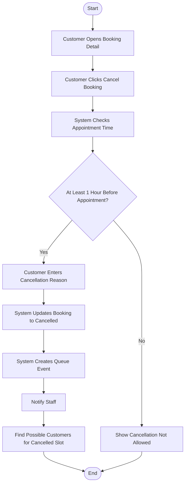

## Front Desk Queue Flow

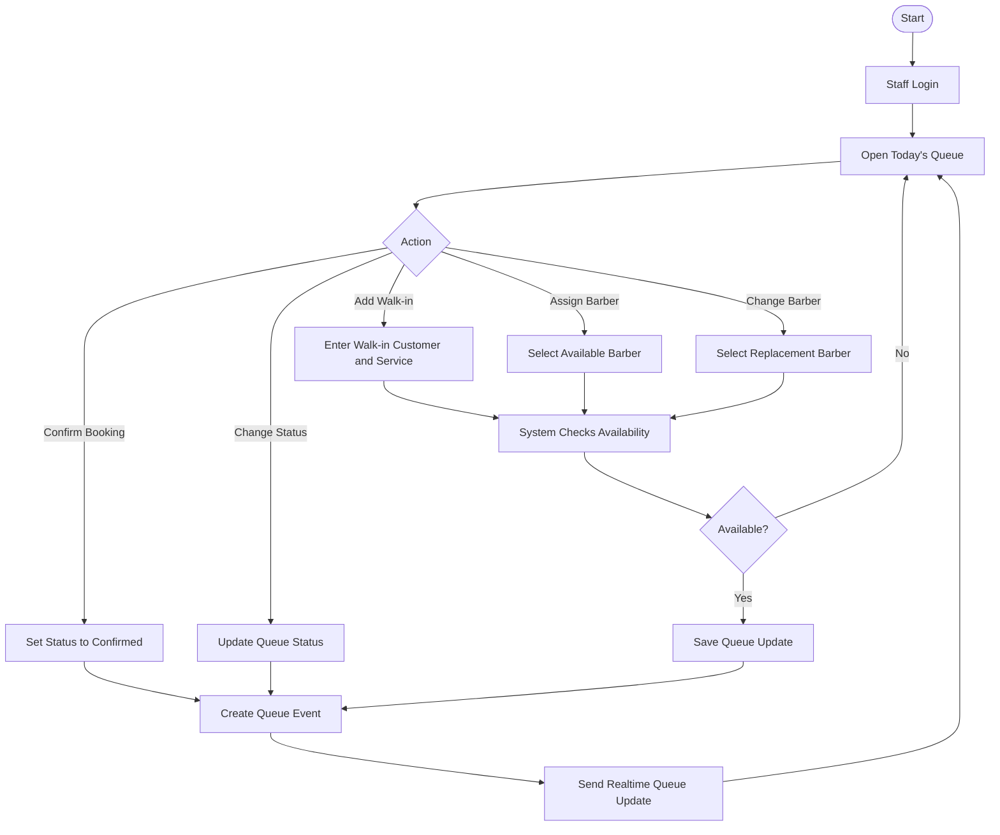

## Barber Service Flow

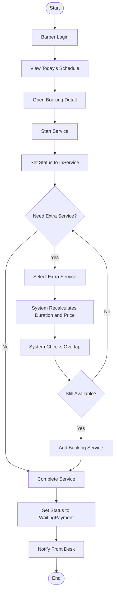

## Payment Flow

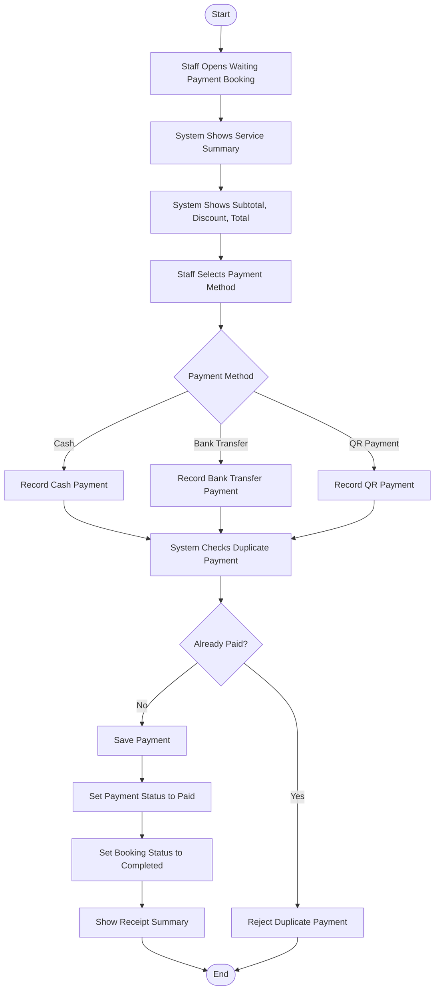

## Personnel And Role Management Flow

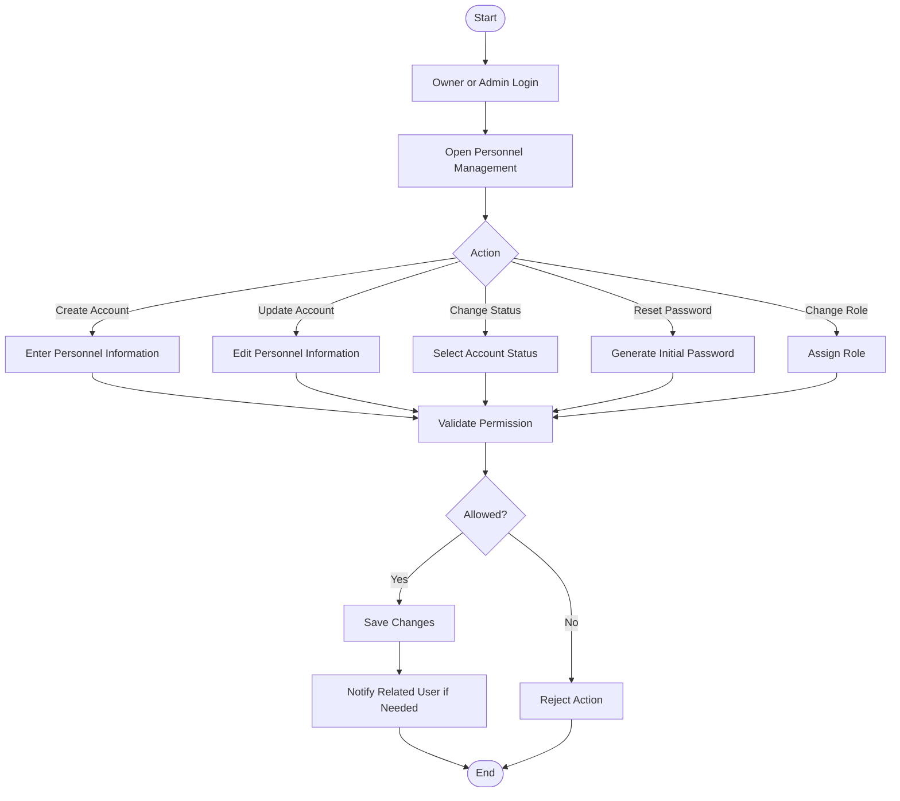

## Barber Leave Flow

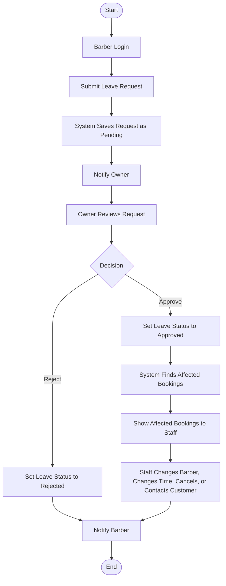

## Promotion Flow

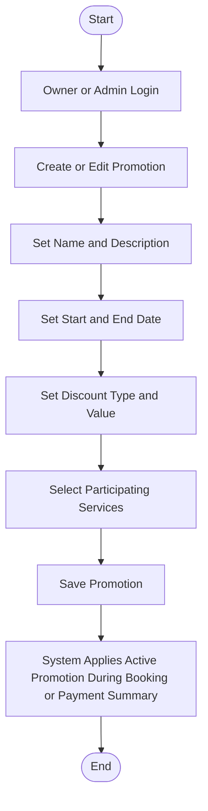

## Report Flow

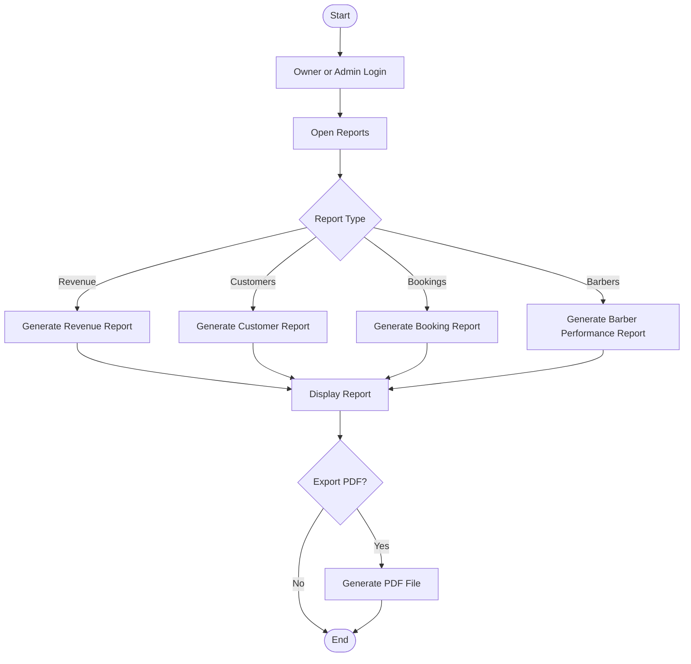

## Status Flow

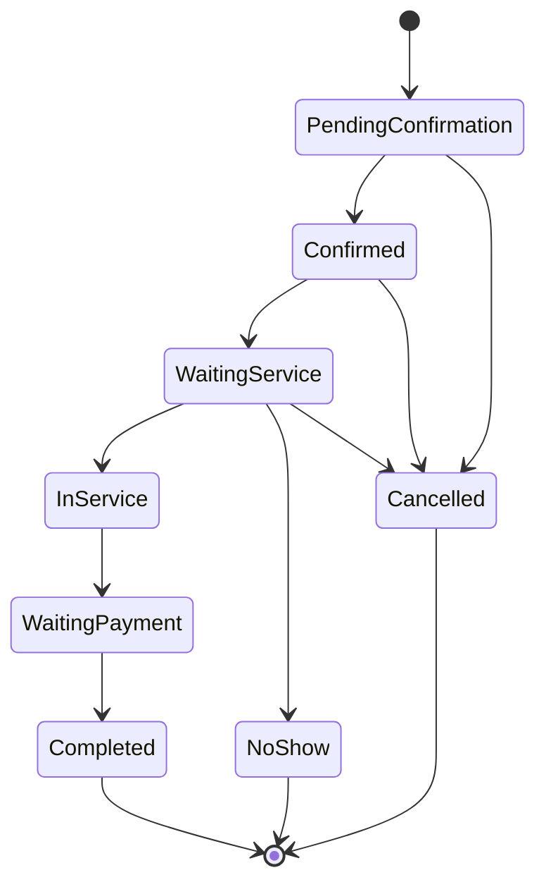

## Notes

- The system flow is based on the approved project scope.
- Some flows may be adjusted after detailed UI and API design.
- The next document should be the Data Flow Diagram.
