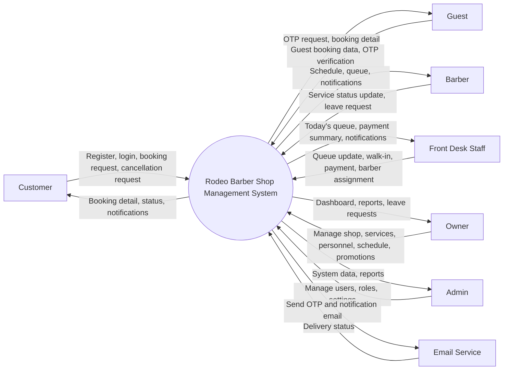
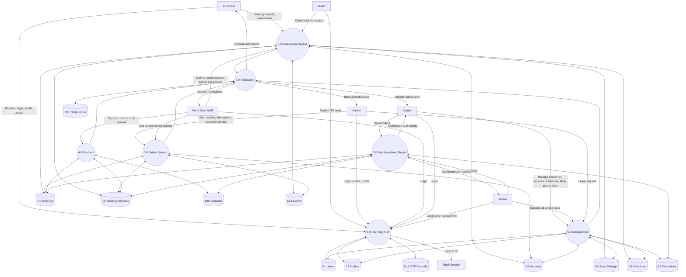
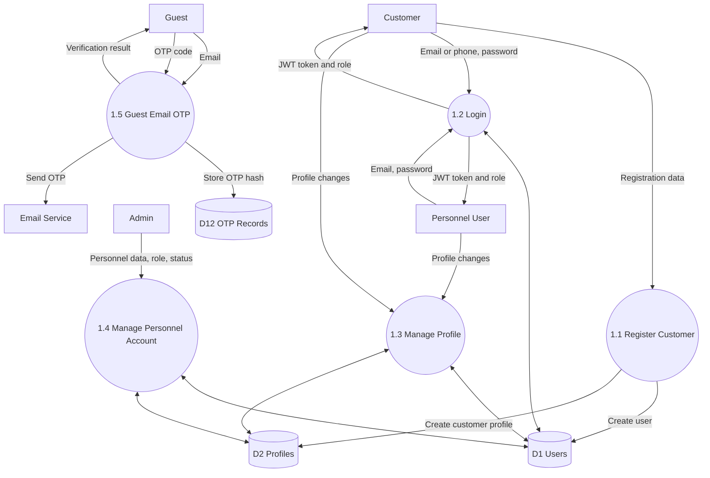
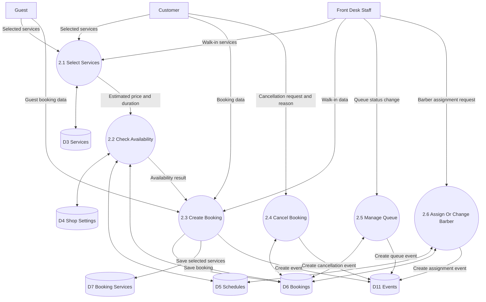
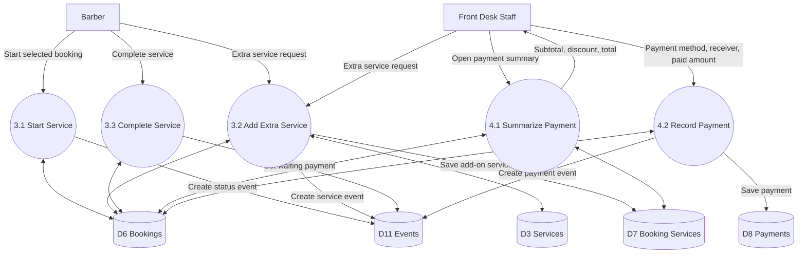
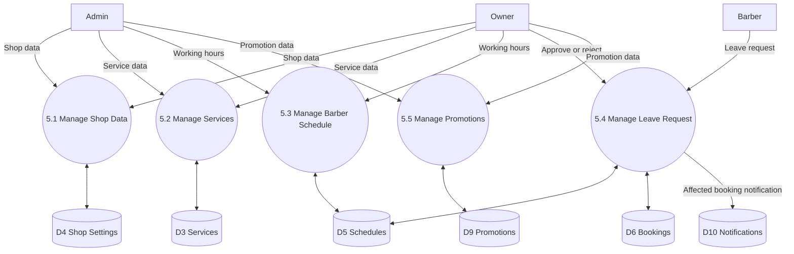
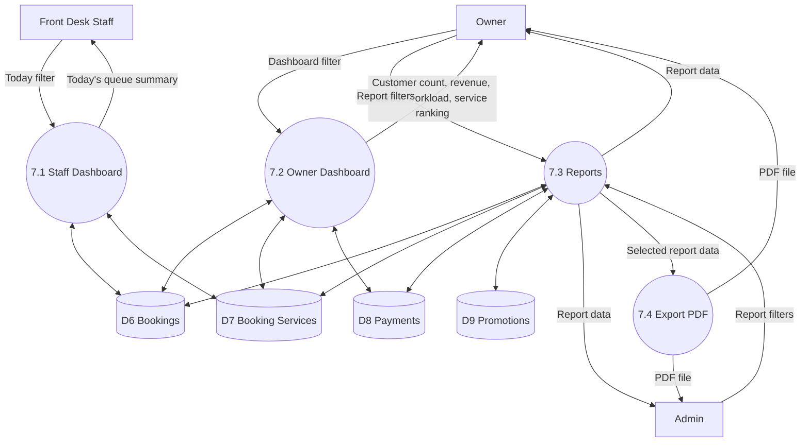

# Data Flow Diagram

## Version

Version: 1.0  
Status: Draft  
Source: Approved project scope document

## Overview

This document describes the Data Flow Diagram for Rodeo Barber Shop Management System.

The diagrams are written with Mermaid so they can be previewed in Markdown-supported tools.

## External Entities

| Entity | Description |
|--------|-------------|
| Customer | Registered customer who books and manages appointments |
| Guest | Non-registered customer who books with Email OTP |
| Barber | Barber who views schedule, manages service status, and submits leave |
| Front Desk Staff | Staff who manages queue, walk-ins, barber assignment, and payment |
| Owner | Shop owner who manages business data, schedules, dashboard, and reports |
| Admin | System administrator with full management permission |
| Email Service | External service used to send OTP and notifications |

## Data Stores

| Data Store | Description |
|------------|-------------|
| D1 Users | User accounts, roles, account status, password hashes |
| D2 Profiles | Customer and barber profile information |
| D3 Services | Service list, price, duration, active status |
| D4 Shop Settings | Shop information, opening hours, holidays |
| D5 Schedules | Barber working hours and leave requests |
| D6 Bookings | Online bookings, guest bookings, walk-ins, queue status |
| D7 Booking Services | Selected services and add-on services per booking |
| D8 Payments | Payment records, methods, totals, receiver |
| D9 Promotions | Promotions and participating services |
| D10 Notifications | Internal website notifications |
| D11 Events | Queue and barber assignment event history |
| D12 OTP Records | Guest booking OTP hashes and verification status |

## Context Diagram

## Level 0 DFD

## Level 1: User And Auth

## Level 1: Booking And Queue

## Level 1: Barber Service And Payment

## Level 1: Management

## Level 1: Dashboard And Report

## Data Flow Notes

1. Passwords and OTP values must be stored as hashes only.
2. Booking creation must read services, shop settings, barber schedules, leave records, and existing bookings before saving.
3. Queue status changes must update bookings and create event history.
4. Payment recording must check for an existing paid payment before saving.
5. Report APIs should read from booking, booking service, payment, and promotion data.
6. Notifications should be stored in the database and pushed through realtime communication when available.

## Open Questions

1. Which email provider will be used for OTP?
2. Does QR Payment require slip image upload?
3. Should PDF exports be stored, or generated on demand only?
4. Should staff be able to edit guest customer contact data after booking?
5. Should cancelled slot notifications be sent by internal notification only or email too?
